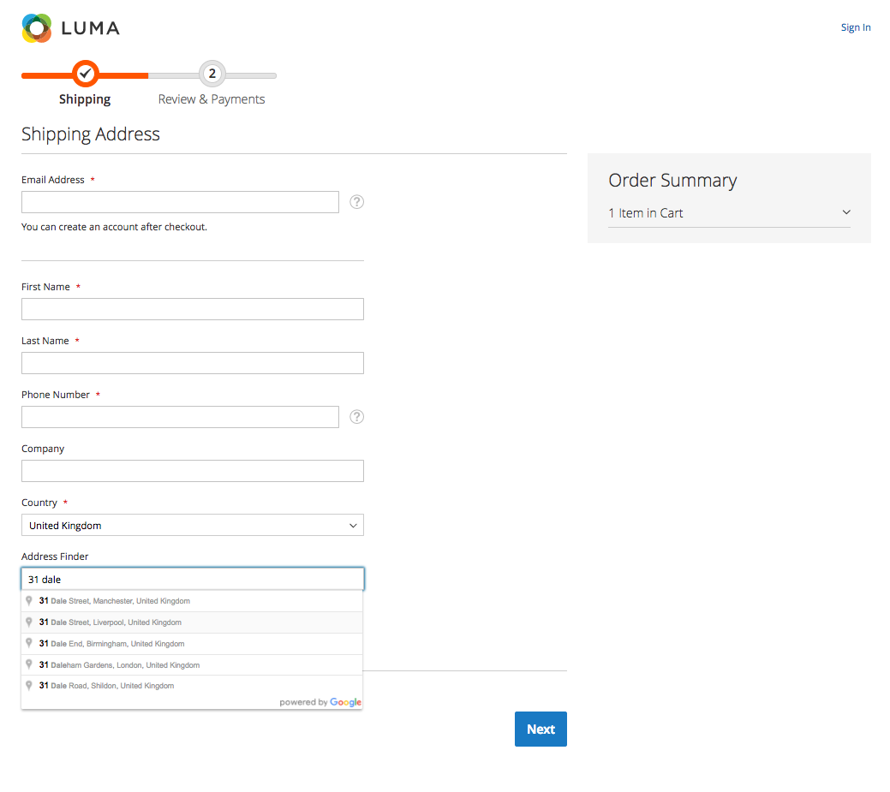
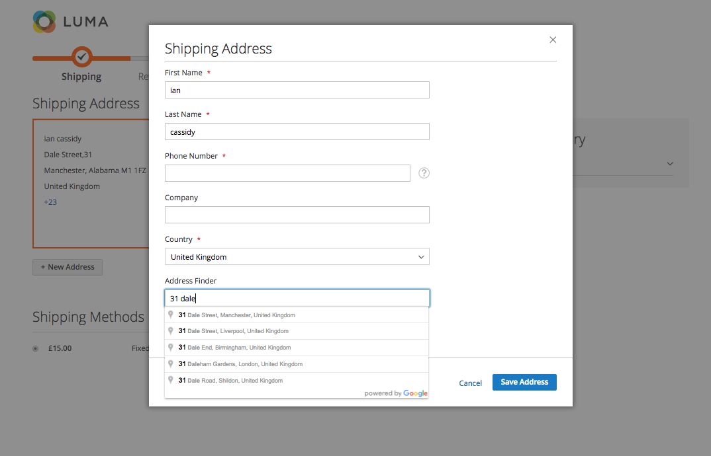

# M2Commerce: Magento 2 Google Address Auto Complete

## Summary
The extension features address auto-complete for checkout using the Google Places API Web Service to provide the following functionality to your Magento 2 store.

- Guest checkout support for entering shipping address
- Logged in customer entering a new shipping address at checkout

**Note**: The Google Places API offers 150,000 FREE daily lookup requests for users that validate their account and add billing information. If you require more than 150,000 lookup requests daily then you can register to a paid plan. [See Usage Tiers & Pricing](https://developers.google.com/places/web-service/usage#verify_your_identity_by_enabling_billing)

## Configuration

There are some configuration options for this extension, which can be found at **STORES > Configuration > Commerce Enterprise > Google Address AutoComplete**.

### ScreenShots



## Installation
### Magento® Marketplace

This extension will also be available on the Magento® Marketplace when approved.

1. Go to Magento® 2 root folder
2. Require/Download this extension:

   Enter following commands to install extension.

   ```
   composer require m2commerce/google-address-auto-complete"
   ```

   Wait while composer is updated.

   #### OR

   You can also download code from this repo under Magento® 2 following directory:

    ```
    app/code/M2Commerce/GoogleAddressAutocomplete
    ```    

3. Enter following commands to enable the module:

   ```
   php bin/magento module:enable M2Commerce_GoogleAddressAutocomplete
   php bin/magento setup:upgrade
   php bin/magento setup:di:compile
   php bin/magento cache:clean
   php bin/magento cache:flush
   ```

4. If Magento® is running in production mode, deploy static content:

   ```
   php bin/magento setup:static-content:deploy
   ```
